<h1>About This Project</h1> 
Project was created using Node.js, Express.js, EJS, PostgreSQL, Primsa, Passport.js HTML, and CSS. The purpose of this project was to create a mini verison of a Google drive. Users can be created, authenticated users can then create folders, upload files into them, those files can then be uploaded into the cloud for storage. Users can also edit folder names, download files, delete folders, delete files and also users can only view their own folders. This project is an excellent example of using core backend concepts such as using the MVC pattern, GET, DELETE, UPDATE and PATCH requests, using Express.js to handle asynchronous operations, using Multer middleware, and performing CRUD operations on the database using PostgreSQL and Prisma ORM. 

<br> 

<h1>What I learned</h1>
    <ul>
    <li>User authentication with Passport.js</li>
<li>Using the MVC pattern to structure the website and separate code</li>
<li>Practice with Express.js middleware to handle requests and asynchronous operations</li>
<li>Form validation and sanitization</li>
<li>Using Multer middleware for file uploads
<li>Cloudinary for cloud based file storage</li>
<li>Writing PostgreSQL queries and Prisma ORM for creating, reading, updating and deleting data </li>
<li>Using EJS to dynamically render content, for example user logs in and see's a welcome message or displaying all the folders associated with a user</li>

 

 <h1>Build With</h1>


 
 
 
  
 


<h1>Getting Started</h1>

To get project cloned locally: git clone git@github.com:alecnissen/File-Uploader-2.git

then ``` npm install ``` which will install all dependency's and packages.

<h1>Demo Video</h1>

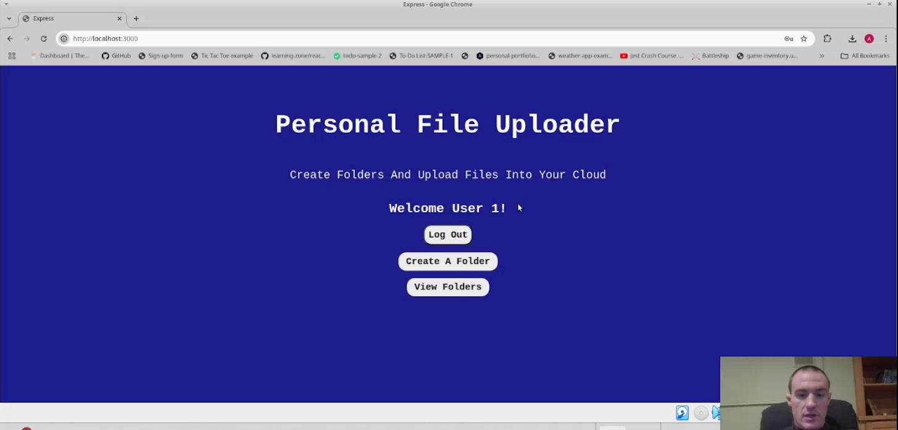

[Watch the demo video on YouTube](https://www.youtube.com/watch?v=gwKTYj_1Dlg&t=1s)


<h1>Features</h1>

- Welcome page where users can log in or choose to create a user.

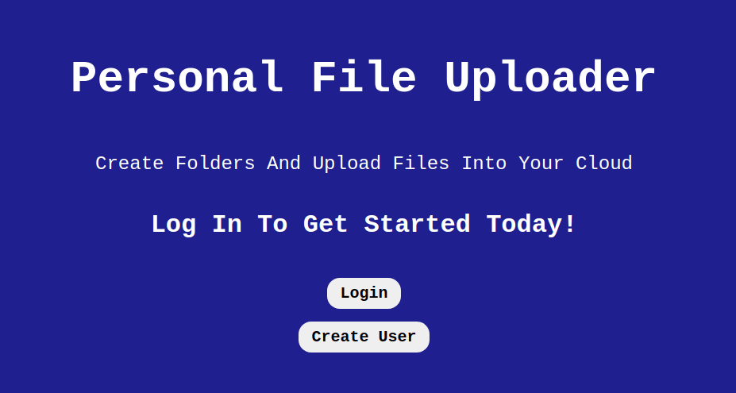

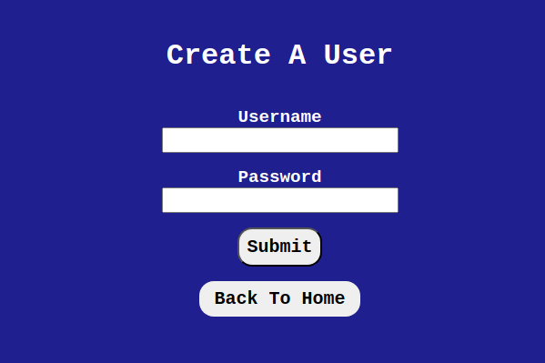

- User authentication and validation to ensure only users with valid credentials can log in.

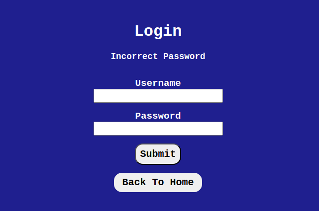

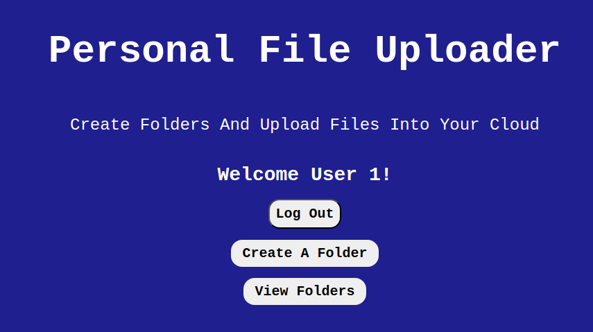

- Users can create folders and upload files into them. A success or error message will display to alert the user if file upload was successful.

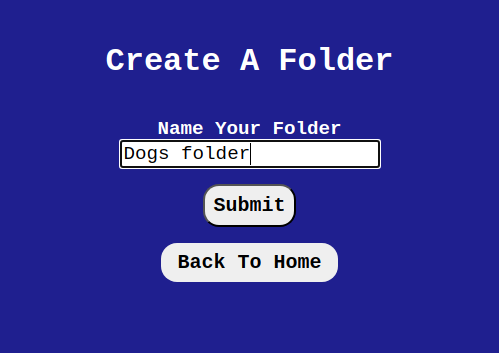

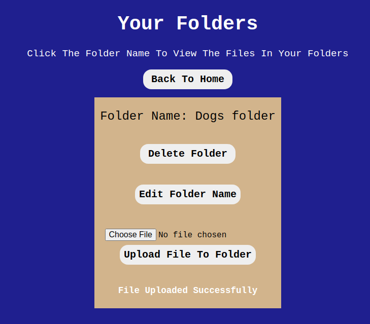

- Users can change the folder name

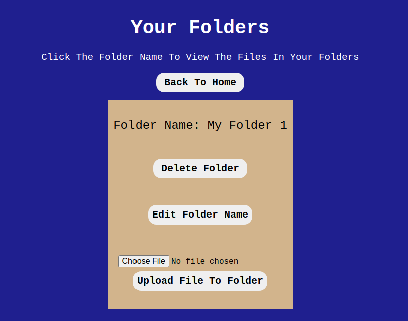

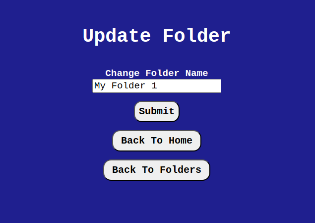

- Files can be uploaded to the cloud for storage. A success or error message will be displayed to alert the user if file upload was successful.

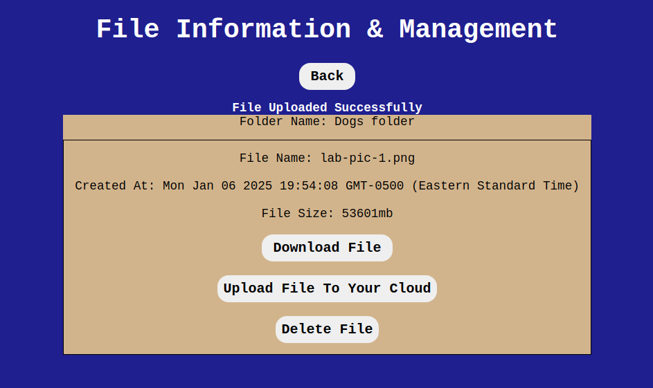

- Users can download the files and also delete files. The user can also delete the folder entirely erasing all the files within that folder.

- Folders are unique to each user. Another user cannot view other users folders. 


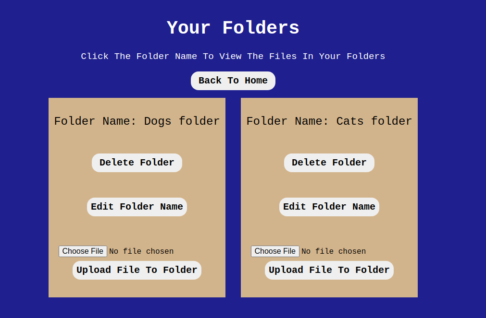


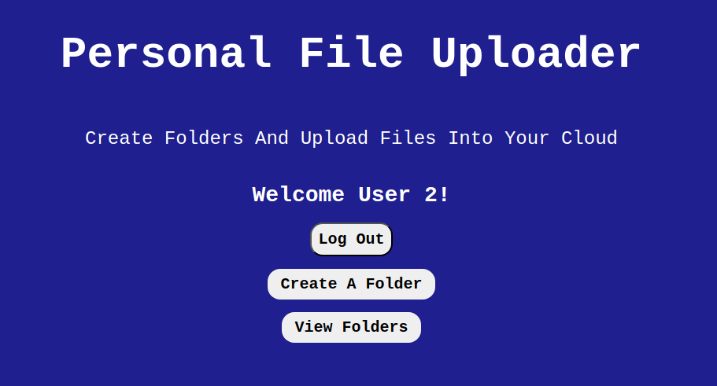
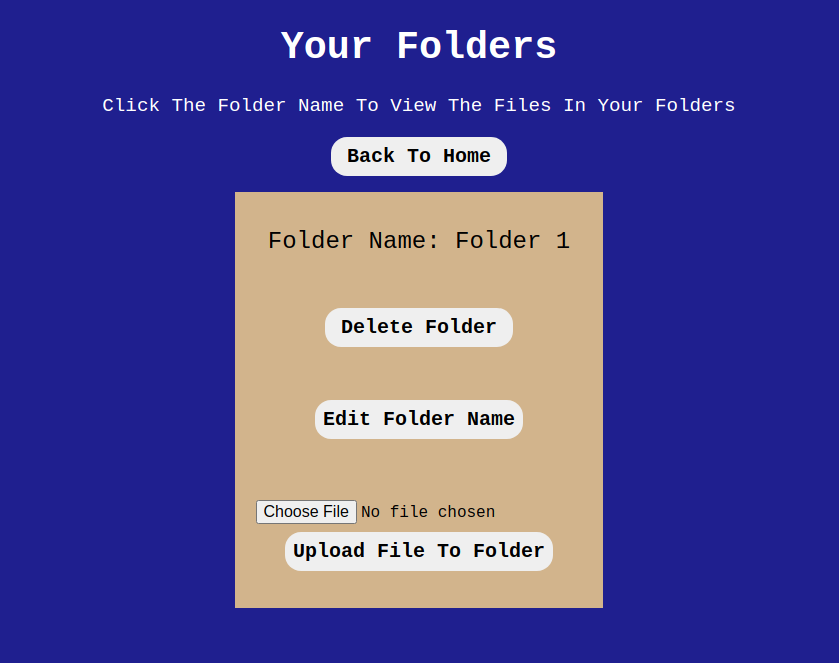


<h1>Acknowledgments</h1> Thank you to everyone within The Odin Project Curriculum from the bottom of my heart! Thank you to anyone who helped me in the discord channels. I promise to help others throughout this journey. 

<h1>Contact</h1>

Creator: Alec J Nissen 
<br>
E-Mail: alec.j.nissen@gmail.com
<br>
GitHub: https://github.com/alecnissen/File-Uploader-2